# TDMA Schedule Planner & Optimizer

A Python-based TDMA scheduler for wireless radio networks. The project converts radio coordinates into a communication graph, derives **distance-2 interference constraints**, assigns conflict-free transmission slots, and exports the resulting schedule for **EMANE** emulation.

## TDMA System Architecture

```mermaid
flowchart LR
    A["Node Coordinates<br/>16 Radios • 4×4 Grid<br/>300 m Spacing"] --> B["Communication Graph<br/>500 m Radio Range"]
    B --> C["Distance-2 Conflict Graph<br/>1-Hop + Common-Neighbor Conflicts"]
    C --> D["Graph Coloring<br/>DSATUR / Heuristic Assignment"]
    D --> E["Spatial Reuse<br/>Slot Compaction"]
    E --> F["TDMA Schedule<br/>9 Slots"]
    F --> G["Schedule Matrix<br/>Slot × Node"]
    F --> H["EMANE TDMA XML"]
    H --> I["16 EMANE NEMs<br/>TDMA Radio Model"]
    I --> J["Virtual Interfaces<br/>emane1 – emane16"]
    J --> K["Packet-Level Validation<br/>5/5 Received • 0% Loss"]

    style A fill:#eaf3ff,stroke:#4a90e2,stroke-width:2px
    style B fill:#eef8ff,stroke:#4a90e2,stroke-width:2px
    style C fill:#fff4df,stroke:#e5a33a,stroke-width:2px
    style D fill:#eefaf2,stroke:#3eaf68,stroke-width:2px
    style E fill:#f5edff,stroke:#9568cf,stroke-width:2px
    style F fill:#ffeaea,stroke:#d45c5c,stroke-width:2px
    style G fill:#f7f7f7,stroke:#777,stroke-width:2px
    style H fill:#f0f0ff,stroke:#6969c8,stroke-width:2px
    style I fill:#fff4df,stroke:#e5a33a,stroke-width:2px
    style J fill:#eef8ff,stroke:#4a90e2,stroke-width:2px
    style K fill:#eefaf2,stroke:#3eaf68,stroke-width:2px
```



## Overview

The scheduler follows this pipeline:

```text
Node Coordinates
      │
      ▼
Communication Graph
      │
      ▼
Distance-2 Conflict Graph
      │
      ▼
Graph Coloring
      │
      ▼
Spatial Reuse / Slot Compaction
      │
      ▼
TDMA Schedule + Slot Matrix
      │
      ▼
EMANE TDMA XML
      │
      ▼
16-NEM EMANE Network
      │
      ▼
Packet-Level Validation
```

For the supplied **16-node 4×4 topology**, using a **500 m communication range** and **300 m node spacing**, the implementation produces a **9-slot conflict-free schedule**.

## Scheduling Model

Each radio is represented as a node in a communication graph.

- Two radios within the configured radio range are connected.
- The scheduler builds a **distance-2 conflict graph**.
- Directly connected nodes must use different slots.
- Nodes that share a common neighbor must also use different slots.
- Nodes outside the modeled distance-2 conflict relationship may reuse a slot.
- Spatial reuse reduces the TDMA frame length while preserving the conflict constraint.

The implementation uses graph-coloring heuristics and then compacts slot assignments without introducing conflicts.

For the supplied topology, the conflict graph has a **9-node clique**, establishing a lower bound of 9 slots. The generated schedule also uses 9 slots, so the result is optimal for that modeled topology.

## Example Topology

| Parameter | Value |
| --- | --- |
| Radios | 16 |
| Layout | 4 × 4 grid |
| Node spacing | 300 m |
| Radio range | 500 m |
| Interference model | Distance-2 |
| Frame length | 9 slots |
| Spatial reuse | Enabled |

## Final Node-to-Slot Assignment

| Node | Slot |
| --- | ---: |
| Node_01 | 8 |
| Node_02 | 7 |
| Node_03 | 4 |
| Node_04 | 8 |
| Node_05 | 6 |
| Node_06 | 2 |
| Node_07 | 0 |
| Node_08 | 5 |
| Node_09 | 5 |
| Node_10 | 1 |
| Node_11 | 3 |
| Node_12 | 6 |
| Node_13 | 8 |
| Node_14 | 7 |
| Node_15 | 4 |
| Node_16 | 8 |

### Slot Occupancy

| Slot | Assigned radios |
| ---: | --- |
| 0 | Node_07 |
| 1 | Node_10 |
| 2 | Node_06 |
| 3 | Node_11 |
| 4 | Node_03, Node_15 |
| 5 | Node_08, Node_09 |
| 6 | Node_05, Node_12 |
| 7 | Node_02, Node_14 |
| 8 | Node_01, Node_04, Node_13, Node_16 |

Nodes sharing a slot are spatially reusable under the modeled distance-2 conflict graph.

## Project Structure

```text
Radio-Sheduler/
├── tdma_scheduler.py
├── run_from_file.py
├── sample_input.json
├── hidden_terminal_test.json
├── spatial_reuse_test.json
├── test_scheduler.py
├── validation_tests.py
├── requirements.txt
├── TESTING.md
├── README.md
└── emane/
    ├── README.md
    ├── platform-16nem.xml
    ├── tdma-schedule.xml
    ├── tdmaradiomodel.xml
    ├── transvirtual.xml
    └── nem/
        ├── tdmanem-1.xml
        ├── tdmanem-2.xml
        ├── ...
        └── tdmanem-16.xml
```

## Requirements

- Python 3.9+
- NetworkX
- Dependencies listed in `requirements.txt`
- EMANE 1.5.3 for the emulation stage

## Installation

Create a virtual environment:

```bash
python -m venv .venv
```

Activate it:

```bash
# Linux / macOS
source .venv/bin/activate

# Windows PowerShell
.venv\\Scripts\\Activate.ps1
```

Install the project dependencies:

```bash
python -m pip install --upgrade pip
python -m pip install -r requirements.txt
```

## Run the Scheduler

Run the file-based example:

```bash
python run_from_file.py sample_input.json
```

Or run the scheduler directly with JSON coordinates:

```bash
python tdma_scheduler.py --coordinates '{"Node_01":[0,0],"Node_02":[300,0]}' --range 500
```

The scheduler:

1. Parses the node coordinates.
2. Builds the communication graph.
3. Builds the distance-2 conflict graph.
4. Performs graph coloring.
5. Applies spatial reuse.
6. Generates the Slot × Node matrix.
7. Verifies that no conflict pair shares a slot.

## Testing

Run the unit tests:

```bash
python test_scheduler.py
```

Run the validation scenarios:

```bash
python validation_tests.py
```

The completed validation covered:

- 16-node topology loading
- 500 m communication range
- Distance-2 conflict detection
- Conflict-free slot assignments
- One-slot-per-node validation
- Schedule matrix validation
- Direct interference
- Hidden-terminal behavior
- Spatial reuse
- Isolated nodes
- 16-node grid scheduling
- Slot-efficiency checks
- Communication-graph construction

### Recorded Results

| Test group | Result |
| --- | --- |
| Unit tests | **7/7 passed** |
| Validation tests | **8/8 passed** |
| 16-node schedule | **9 slots** |
| Conflict verification | **Passed** |

## EMANE Integration

The generated Node-to-Slot mapping is exported to an EMANE TDMA schedule.

The integration contains:

- EMANE platform configuration
- 16 NEM-specific configurations
- TDMA radio model configuration
- Virtual transport configuration
- TDMA schedule XML

Node IDs map directly to EMANE NEM IDs:

```text
Node_01 → NEM 1
Node_02 → NEM 2
...
Node_16 → NEM 16
```

The EMANE configuration is contained in the [`emane/`](emane/) directory.

A schedule can be delivered through the EMANE TDMA event utility:

```bash
emaneevent-tdmaschedule emane/tdma-schedule.xml -i <event-device>
```

The TDMA scheduler counters can be inspected with `emanesh`.

## EMANE Verification

The 16-NEM integration was exercised under **Ubuntu 24.04 on WSL2**.

Verified:

- All 16 NEMs started successfully.
- The TDMA schedule was accepted.
- The Node-to-Slot mapping matched the EMANE schedule.
- Virtual interfaces `emane1` through `emane16` were created.
- Packet-level testing completed with **5 packets transmitted, 5 received, and 0% loss**.

### Environment Limitation

WSL2 reported limitations related to real-time thread priority. Therefore, the EMANE result demonstrates **functional TDMA schedule integration and packet delivery**, not real-time hardware timing fidelity.

## Scope and Assumptions

The scheduler uses a symmetric Euclidean distance threshold for connectivity.

It does not model:

- RF propagation loss
- Link asymmetry
- Traffic demand
- Per-slot payload capacity
- Detailed PHY interference
- Hardware clock synchronization
- Real-world RF channel conditions

The schedule guarantees the modeled **distance-2 graph constraint**; it is not intended to be a complete physical-layer interference simulator.

## Technologies

- Python
- NetworkX
- Graph coloring / DSATUR
- JSON
- XML
- EMANE
- Ubuntu / Linux
- WSL2

## Repository

[GitHub Repository](https://github.com/ekanathan246-maker/Radio-Sheduler)

## License

MIT License. See [`LICENSE`](LICENSE).
